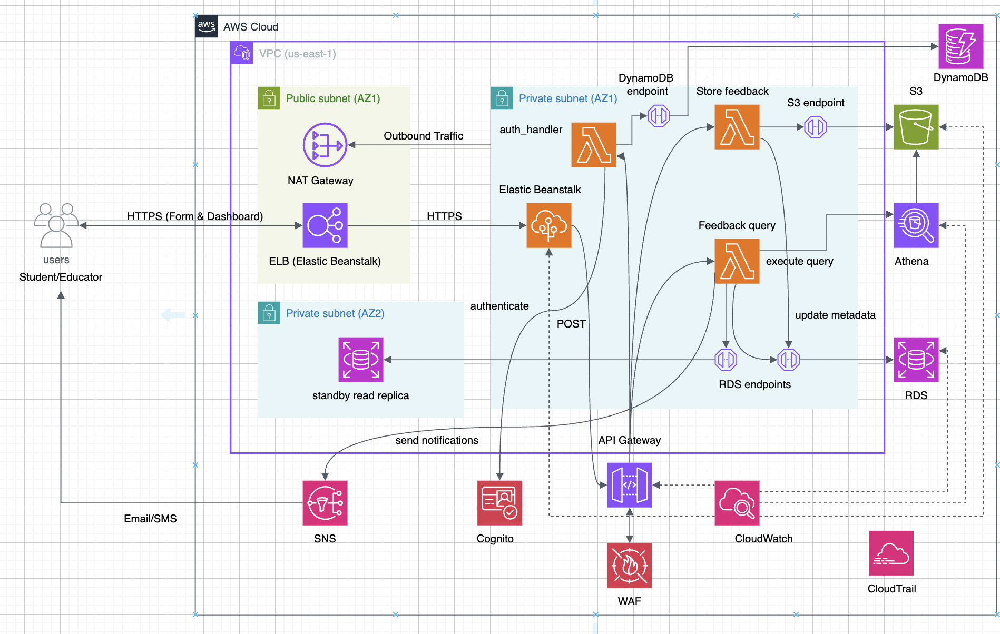

# 📊 CourseSense – Course Feedback Analysis Platform

**CourseSense** is a cloud-native, secure, and scalable platform developed as the final project for the *Advanced Cloud Architecting* course at Dalhousie University. It enables automated collection, processing, and analysis of student course feedback through a modern serverless architecture on AWS.

Designed with a focus on operational excellence, security, performance efficiency, and cost optimization, CourseSense leverages AWS managed services to provide real-time insights for instructors and academic administrators, replacing manual analysis with actionable data visualizations and alerts.

---

## 🚀 Features

🔐 **Secure Authentication**  
User management and role-based access via Amazon Cognito with multi-factor authentication (MFA) and session tracking via DynamoDB.  
   
📨 **Feedback Collection**  
Students submit feedback through a web dashboard powered by Elastic Beanstalk, routed through API Gateway to a processing Lambda.  

📁 **Data Storage**  
Structured feedback is stored securely in Amazon RDS (MySQL), while raw data and analytics reside in Amazon S3 with versioning and encryption.  

📊 **Real-Time Analytics**  
Educator queries trigger Amazon Athena via Lambda to fetch summarized trends, with results streamed back to the UI.  

📣 **Smart Notifications**  
Low rating submissions trigger Amazon SNS alerts, enabling quick instructor response to dissatisfaction trends.  

📡 **Monitoring & Auditing**  
All interactions are logged with Amazon CloudTrail and visualized via CloudWatch alarms and dashboards for observability.  

🛡️ **Threat Protection**  
API Gateway is integrated with AWS WAF for rate limiting and protection from common web exploits.  

---

## 🏗️ Architecture Overview

- **Frontend**: Web UI hosted on **Elastic Beanstalk** (Node.js), secured behind a public-facing ELB
- **Backend Compute**:  
  - **Lambda** for:
    - Authentication (`auth-handler-lambda`)
    - Feedback submission (`feedback-lambda`)
    - Instructor analytics queries (`query-lambda`)
- **Storage & Data**:  
  - **Amazon RDS** (MySQL, multi-AZ)
  - **Amazon S3** (feedback logs, query results)
  - **Amazon DynamoDB** (session state)
- **Analytics**: **Amazon Athena** for querying S3 feedback data  
- **Networking & Security**:  
  - **Amazon VPC** with public/private subnets  
  - **NAT Gateway**, **VPC endpoints**, **Secrets Manager**, **AWS KMS**  
- **Monitoring**:  
  - **Amazon CloudWatch** for metrics and alarms  
  - **AWS CloudTrail** for full activity logging  

---

## 🧰 Tech Stack

| Layer        | Technology                  |
|--------------|------------------------------|
| Frontend     | Elastic Beanstalk (Node.js)  |
| Auth         | Amazon Cognito, DynamoDB     |
| Backend      | AWS Lambda (Python)          |
| Data Store   | Amazon RDS (MySQL), S3       |
| Analytics    | Amazon Athena                |
| Monitoring   | CloudWatch, CloudTrail       |
| Security     | Secrets Manager, KMS, WAF    |
| Deployment   | Terraform, AWS CLI           |

---

## 📈 Performance & Resilience

- **Response Time**: Avg. under 3 seconds for feedback submission and analytics
- **Reliability**: Multi-AZ RDS, Elastic Beanstalk auto-scaling (1–4 instances)
- **Scalability**: Stateless Lambda functions and throttled API Gateway endpoints
- **Security**: Private subnets, IAM roles, audit logging, and encrypted storage
- **Cost Optimization**: Estimated $7–$10/month, using serverless and intelligent tiering
